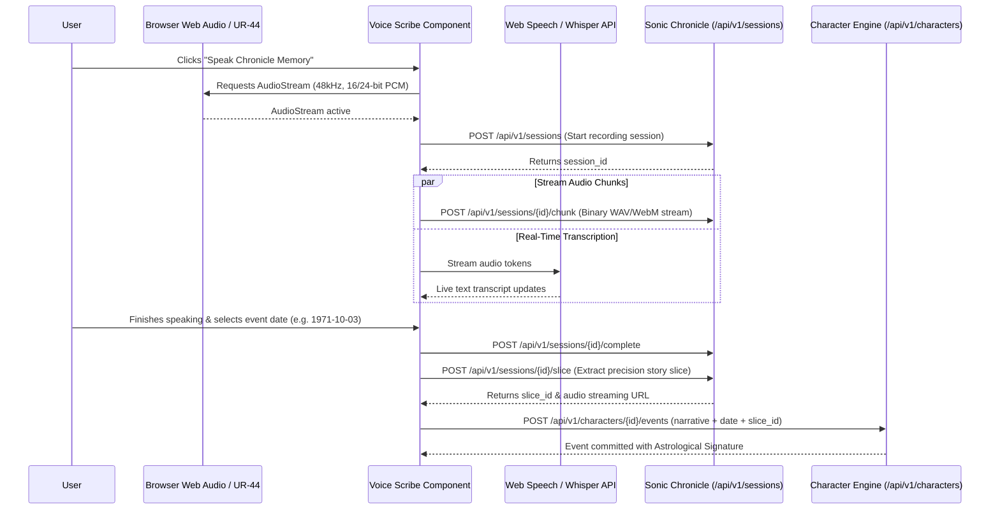

# Specification & To-Do: Speech & Audio Integration Details ("Voice of Logos")

## 1. Overview & Architectural Purpose
This module defines the **Voice-First Input Substrate** for recounting life stories in Mercury Dasha. It provides the end-to-end pipeline allowing the user to speak their memories naturally, capturing studio-grade uncompressed audio, producing precision audio slices, generating transcripts, and binding the resulting audio artifact directly to a `ChronicleEvent`.

It bridges browser-level microphone capture with the sovereign Go single-binary backend and the existing **Sonic Chronicle** audio engine (`backend/internal/session/`).

---

## 2. End-to-End Voice Capture Pipeline



---

## 3. Audio Capture Substrate & Ingestion Protocols

### 3.1 Browser Client Substrate (`frontend/lib/audio-recorder.ts`)
1. **Audio Context Configuration**:
   - Sample Rate: `48000 Hz` (Broadcast & Studio standard matching Steinberg UR-44 line-in).
   - Channels: `1` (Mono for vocal speech dictation, minimizing storage overhead) or `2` (Stereo when capturing ambient session context).
   - Bit Depth: `16-bit` linear PCM.
2. **Streaming Chunk Mechanism**:
   - Uses `MediaRecorder` API with timeslice intervals (e.g. `2000ms` chunks).
   - MimeType: `audio/webm;codecs=opus` with fallback to native `audio/wav`.
   - Sends incremental chunks via `POST /api/v1/sessions/{id}/chunk`.

### 3.2 Hardware Studio Interface (Steinberg UR-44 Support)
- For high-fidelity physical studio recording, the system supports direct audio device selection via `navigator.mediaDevices.enumerateDevices()`.
- The user can select their USB audio interface (e.g. "Steinberg UR-44 (Line In 1/2)") directly in the Chronicle Scribe settings modal.
- Native POSIX recording script integration via `scripts/record-ur44.sh` for offline high-fidelity session archiving.

---

## 4. Sonic Chronicle Backend Integration (`backend/internal/session/`)

The character engine leverages the existing audio engine without reinventing file storage:
1. **Session Lifecycle**:
   - `CreateSessionHandler` initializes an `AudioSession` with `category: "chronicle_narrative"`.
   - `SessionChunkHandler` appends binary audio data into the storehouse under `/home/justin/Dropbox/audio/` (or local `.data/audio/`).
   - `CompleteSessionHandler` updates the WAV header with final byte lengths and exact duration.
2. **Precision Slicing (`PrecisionSliceHandler`)**:
   - When a story chapter corresponds to a specific segment of a session, `/api/v1/sessions/{id}/slice` creates an `AudioSlice` with accurate `StartMs` and `EndMs`.
   - Generates an independent WAV sub-slice that can be streamed without loading the entire master session.
3. **HTTP 206 Partial-Content Streaming (`SessionStreamHandler`)**:
   - Allows instant seeking and scrubbed playback in the frontend timeline milestone card via native `<audio>` elements.

---

## 5. Speech-to-Text & Transcription Strategy

To guarantee both instant feedback and archival precision, transcription is structured in two tiers:

### Tier 1: Real-Time Client-Side Transcription (Web Speech API)
- **Engine**: Browser-native `webkitSpeechRecognition` / `SpeechRecognition`.
- **Latency**: `< 100ms`.
- **Purpose**: As the user speaks, text appears live in the Scribe text box, allowing real-time confidence checking, pause detection, and immediate post-recording editing.
- **Cost / Overhead**: $0, zero external network calls.

### Tier 2: Precision Archival Transcription (Local / API Whisper)
- **Engine**: Local Whisper / Gemini multimodal audio endpoint.
- **Workflow**:
  - When the recording session completes, the server or background worker runs high-accuracy transcription over the slice.
  - Automatically segments the audio into timestamped sentences, extracting keywords and emotional inflections.
  - Aligns verbatim text with the `ChronicleEvent.NarrativeText`.

---

## 6. Binding Audio to Chronicle Events

In `ChronicleEvent`:
```go
// In ChronicleEvent struct:
VoiceSessionID  string `json:"voice_session_id,omitempty"` // e.g. "session-20260907-091522"
VoiceSliceID    string `json:"voice_slice_id,omitempty"`   // e.g. "slice-origin-hospital-separation"
VoiceAudioURL   string `json:"voice_audio_url,omitempty"`  // "/api/v1/sessions/{id}/stream" or slice URL
```

### Event Milestone Audio Player Component:
When rendered on the Dasha timeline:
- The milestone card features a waveform mini-player.
- Displays voice duration (e.g. `02:14`).
- Play/Pause/Scrub controls with synchronized text karaoke highlighting (word-level timestamp tracking).

---

## 7. Actionable Implementation Checklist (To-Do)

- [ ] **Step 1: Frontend Audio Recorder Utility** (`frontend/lib/audio/recorder.ts`):
  - Implement `AudioRecorder` class wrapping `navigator.mediaDevices.getUserMedia`.
  - Add input device selector (microphone / Steinberg UR-44).
  - Implement chunked streaming emitter (`onDataAvailable`).
- [ ] **Step 2: Real-Time Speech Recognition Hook** (`frontend/hooks/use-speech-scribe.ts`):
  - Wrap Web Speech API with fallback graceful degradation.
  - Provide continuous transcript accumulation with interim results.
- [ ] **Step 3: Chronicle Voice Scribe Modal** (`frontend/components/chronicle-voice-scribe.tsx`):
  - Audio waveform visualizer (canvas-based frequency bar / oscilloscope).
  - Record / Pause / Stop / Redo controls.
  - Real-time transcript review and editing text area.
  - Historical Date selector with live Astrological Signature preview.
- [ ] **Step 4: Backend Audio Session Integration**:
  - Ensure `backend/internal/session/` handles `category: "chronicle_narrative"`.
  - Validate precision slicing endpoints and HTTP 206 range seeking for voice slices.
- [ ] **Step 5: Voice Milestone Audio Player** (`frontend/components/chronicle-audio-player.tsx`):
  - Compact in-card audio player embedded into timeline milestones.
- [ ] **Step 6: End-to-End Verification**:
  - Test recording via browser mic -> session creation -> audio chunk upload -> slice generation -> event binding -> timeline playback.
